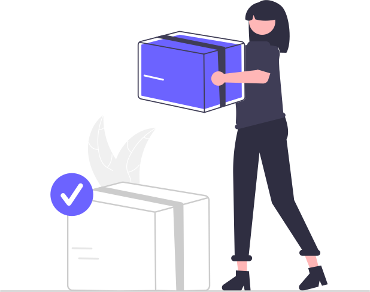

  

:sparkles: A beautiful dark theme for your favorite apps
    

  <!-- Patreon -->
  

  <!-- IssueHunt -->
  

  <!-- ProductHunt -->
  

  

 

### Aura

<table>
  <td valign="top">
    

      
        
      Color Palettes
    

  </td>
  <td valign="top">
    

      
        
      Wallpapers
    

  </td>
  <td valign="top">
    

      
        
      Shop
    

  </td>
</table>

### IDEs and Code Editors

<table >
  <tr>
    <td valign="top">
     

      
        
      Visual Studio Code
      

    </td>
    <td valign="top">
     

      
        
      Sublime Text
      

    </td>
    <td valign="top">
     

      
        
      CodeSandbox
      

    </td>
    <td valign="top">
      

        
          
        Neovim
      

    </td>
  </tr>
 </table>

### Terminals

<table >
  <tr>
    <td valign="top">
      

        
         
        Hyper Terminal
      

    </td>
    <td valign="top">
      

        
         
        Windows Terminal
      

    </td>
    <td valign="top">
      

        
          
        Alacritty
      

    </td>
    <td valign="top">
      

        
         
        iTerm
      

    </td>
    <td valign="top">
      

        
         
        rxvt-unicode
      

    </td>
    <td valign="top">
      

        
         
        Termux
      

    </td>
  </tr>
    <td valign="top">
      

        
         
        Terminal.app
      

    </td>
    <td valign="top">
      

        
         
        GNOME Terminal
      

    </td>
    <td valign="top">
      

        
         
        Kitty
      

    </td>
    <td valign="top">
      

        
         
        Konsole
      

    </td>
    <td valign="top">
      

        
         
        Tabby.sh
      

    </td>
    <td valign="top">
      

        
         
        Tilix
      

    </td>
  </tr>
 </table>

### Browsers

<table >
  <tr>
      <td valign="top">
      

        
          
        Chrome
      

    </td>
    <td valign="top">
      

        
          
        Firefox
      

    </td>
    <td valign="top">
      

        
          
        Vivaldi
      

    </td>
  </tr>
 </table>

### Others

<table >
  <tr>
    <td valign="top">
      

        
          
        Insomnia
      

    </td>
    <td valign="top">
      

        
          
        Fig
      

    </td>
    <td valign="top">
      

        
          
        Telegram Desktop
      

    </td>
    <td valign="top">
      

        
          
        Slack
      

    </td>
    <td valign="top">
      

        
          
        iCue
      

    </td>
    <td valign="top">
      

        
          
        KDE Plasma
      

    </td>
    <td valign="top">
      

        
          
        NGenuity
      

    </td>
    <td valign="top">
      

        
          
        Mattermost
      

    </td>
  </tr>
  <tr>
    <td valign="top">
      

        
          
        Waybar
      

    </td>
    <td valign="top">
      

        
          
        Sway
      

    </td>
  </tr>
 </table>

# Documentation

<table >
  <tr>
    <td valign="bottom">
      

        
          
        Creating Ports
      

    </td>
    <td valign="bottom">
      

        
          
        Aura CLI
      

    </td>
    <td valign="bottom">
      

        
          
        Aura API
      

    </td>
    <td valign="bottom">
      

        
          
        Publishing Ports
      

    </td>
  </tr>
</table>

# Contributing

> Contributions are always welcome, but always **ask first**, — please — before work on a PR.

That said, there's a bunch of ways you can contribute to this project, like by:

- :electric_plug: Making a port of this theme for another apps
- :wave: Requesting a port
- :beetle: Reporting a bug
- :page_facing_up: Improving this documentation
- :test_tube: Making new tests or improving existing ones
- :rotating_light: Sharing this project and recommending it to your friends
- :dollar: Supporting this project on GitHub Sponsors or Patreon
- :bug: Funding an issue on IssueHunt
- :star2: Giving a star on this repository
- :thumbsup: Voting on ProductHunt

# License

[MIT © Dalton Menezes](https://github.com/daltonmenezes/aura-theme/blob/main/LICENSE)
