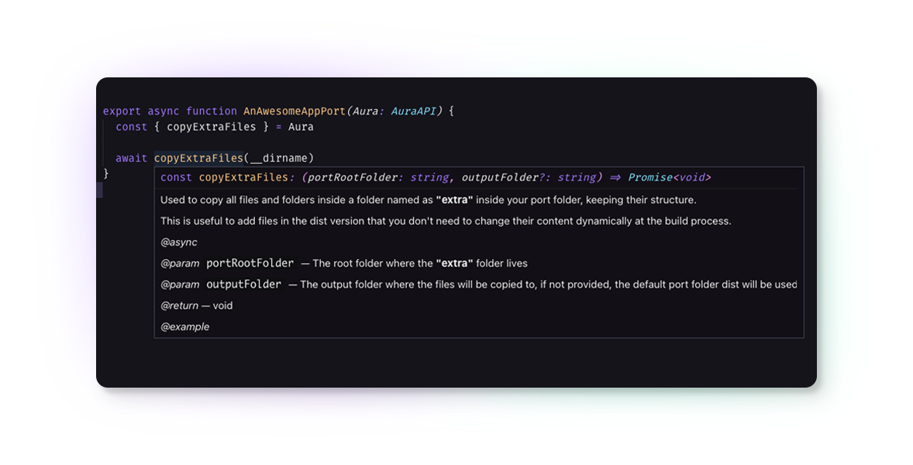

<p align="center">
  
</p>

<h1 align="center">Creating Ports</h1>

<p  align="center">
  
</p>

# First touch in Aura CLI
> 💡 Check the [CLI doc](./CLI.md) to learn more about it

Hello, it's awesome to have you here, so let's create our first port named as `an-awesome-app`. Try it in your terminal:
```js
yarn make port an-awesome-app
```
Good, now you should have the following new files and folders created by the Aura CLI:
```
src/ports/an-awesome-app
├── index.ts
└── templates
    └── README.md
```
Now, it's time to explore their content. 🚀

# Understanding the files created by the Aura CLI
## index.ts
The magic begins here! 🧙‍♂️

This file tells Aura how to handle your port.

```ts
import { AuraAPI } from 'core'
import { resolve } from 'path'

export async function AnAwesomeAppPort(Aura: AuraAPI) {
  const { createPort, createReadme, colorSchemes, constants } = Aura
  const templateFolder = resolve(__dirname, 'templates')
  const { info } = constants

  const portName = 'AnAwesomeApp'
  const version = '1.0.0'

  // await createPort({
  //   template: resolve(templateFolder, `${info.slug}.yml`),
  //   replacements: {
  //     ...colorSchemes.dark,
  //     ...info,
  //   },
  // })

  await createReadme({
    template: resolve(templateFolder, 'README.md'),
    replacements: {
      portName,
      version,
    },
  })
}
```
The most functions to help you to create a port comes from Aura parameter and since Aura is totally written in TypeScript and that functions uses jsdoc whenever it is possible, your code editor will give you the necessary information to understand what each function does without any problem like in following example:



Also, you can check the [API doc](./API.md) for full reference.
See? Make a port is easy-peasy with Aura 💜

Let's move on!

## README.md
This file resides in the `templates` folder for a reason: whenever you need to have the values inside a file dynamically replaced at build/compile time by another, you should put that file in this folder. In this case, you have the README.md file that contains values in curly braces such as the `{{{ basic-heading }}}`. The names between these curly braces are the property ids that you can override through your index.ts file. Currently, Aura uses the Mustache template engine syntax. So, contents you need to keep the real structure in this replacement process like html or markdown parts, you always have to use 3 curly braces, but simple string values can be 2.

```markdown
{{{ basic-heading }}}

# Installation
1. Write the step one
2. Write the step two
... Write the other steps.

# Contributors
<table>
  <thead>
    <tr>
      {{{ author-thead }}}
    </tr>
  </thead>

  <tbody>
    <tr>
      {{{ author-tbody }}}
    </tr>
  </tbody>
</table>

{{{ footer }}}
```

At this point, you might be wondering where `{{{ basic-heading }}}`, `{{{ author-thead }}}`, `{{{ author-tbody }}}` and `{{{ footer }}}` values come from, because in `index.ts` there aren't any of those properties in the replacements object in the `createReadme` function, right?

The `createReadme` function will look by default for some templates to make it available for you, like the files inside `src/shared/templates/readmes` and the values in the `theme` property in the `package.json` file located in the root folder.

About the files in the `src/shared/templates/readme` folder, the name in disk of these files will be converted to the name of the property you can use in your readme. For example, if you create a file named as `hello-aura.md` in `src/shared/templates/readme`, in the `src/ports/an-awesome-app/templates/README.md` file you will be able to access this full file content using `{{{ hello-aura }}}`.

# Creating a new template
In the `src/ports/an-awesome-app/templates` folder, create a file named as `hello-aura.json`.

Put the following content inside it:

```json
{
  "portName": "{{ portName }}",
  "version": "{{ version }}",
  "hello": "{{ hello }}",
  "color": "{{ accent1 }}"
}
```
Now, change the `index.ts` file to:

```ts
import { AuraAPI } from 'core'
import { resolve } from 'path'

export async function AnAwesomeAppPort(Aura: AuraAPI) {
  const { createPort, createReadme, colorSchemes } = Aura
  const templateFolder = resolve(__dirname, 'templates')

  const portName = 'An Awesome App'
  const version = '1.0.0'

  await createPort({
    template: resolve(templateFolder, 'hello-aura.json'),
    replacements: {
      ...colorSchemes.dark,
      portName,
      version,
      hello: 'Hello from Aura!',
    },
  })

  await createReadme({
    template: resolve(templateFolder, 'README.md'),
    replacements: {
      portName,
      version,
    },
  })
}
```

Good, now run the following command in your terminal:

```js
yarn dev only an-awesome-app
```

And at the root folder, look for the `packages/an-awesome-app` folder and open the `hello-aura.json` file. You will see something like this:

```json
{
  "portName": "An Awesome App",
  "version": "1.0.0",
  "hello": "Hello from Aura!",
  "color": "#a277ff"
}
```

As you are now in development mode, any change in your `index.ts` file will trigger the recompiling process when you save it, but files inside your `templates` or `extra` folder will may not. Keep this in mind to always you done any change in files on these folders, to save the index.ts file again just to trigger the recompiler.

Yay! That's it! 🥳
# License
[MIT © Dalton Menezes](https://github.com/daltonmenezes/aura-theme/blob/main/LICENSE)